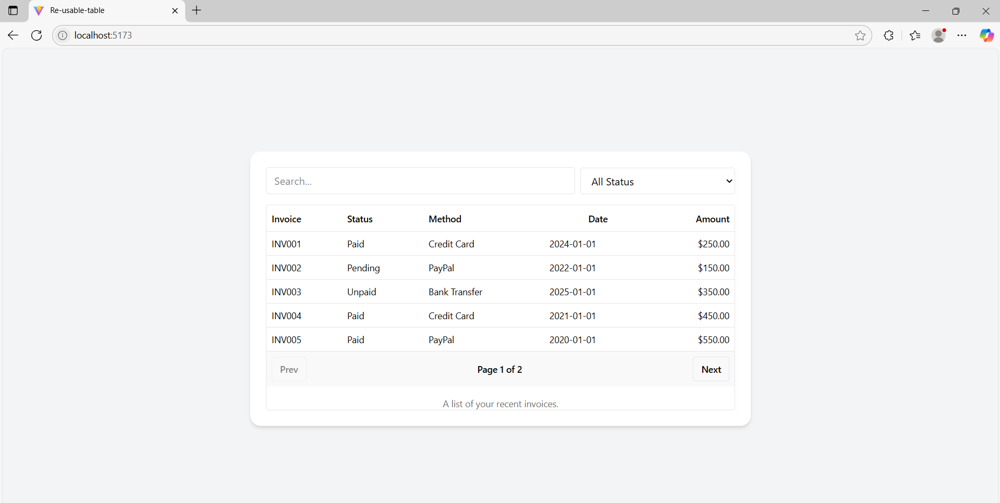

# 🧾 Data Table App

A simple React + TypeScript application that displays a list of invoices using a reusable `DataTable` component with Tailwind CSS styling.

## ✨ Features

- 💡 Reusable and configurable `DataTable` component
- 🎨 Clean and modern UI with Tailwind CSS
- ✅ Strongly typed with TypeScript
- 📱 Responsive layout
- 📊 Customizable column alignment

## 📂 Project Structure

src/
├── App.tsx # Main application component
├── DataTable.tsx # Reusable DataTable component
└── index.tsx # App entry point


## 📄 Invoice Schema

Each invoice object contains the following fields:

| Field          | Type                                    | Description                      |
|----------------|------------------------------------------|----------------------------------|
| `invoice`      | `string`                                 | Unique invoice ID                |
| `paymentStatus`| `"Paid" | "Pending" | "Unpaid"`           | Status of payment                |
| `totalAmount`  | `string`                                 | Total amount billed (e.g., "$250.00") |
| `paymentMethod`| `"Credit Card" | "PayPal" | "Bank Transfer"` | Method used to pay              |
| `paymentDate`  | `string` (ISO format)                    | Date of payment (e.g., `2024-01-01`) |

## 🚀 Getting Started

### 📦 Prerequisites

- Node.js (v14 or higher)
- npm or yarn

### 🔧 Installation

```bash
# Clone the repository
git clone https://github.com/your-username/invoice-data-table.git

# Navigate into the directory
cd invoice-data-table

# Install dependencies
npm install
# or
yarn install


npm run dev
# or
yarn dev

The app will start on http://localhost:5173 (assuming you're using Vite).

⚙️ Customization
Modify the invoices array in App.tsx to show different data.

Update columns to control column titles, alignment, and data binding.

Extend the DataTable component to support sorting, filtering, or pagination.

🛠 Built With
React

TypeScript

Tailwind CSS

Vite (or Create React App if used)

📄 License
This project is licensed under the MIT License.


Let me know if you'd like a version with your GitHub username or a link to the actual `LICENSE` file.

# 🧾 Invoice Data Table App

A simple React + TypeScript application that displays a list of invoices using a reusable `DataTable` component.



## ✨ Features

- 💡 Reusable and configurable `DataTable` component
- 🎨 Clean and modern UI with Tailwind CSS
- ✅ Strongly typed with TypeScript
- 📱 Responsive layout
- 📊 Customizable column alignment

Project Link : https://reusablevitetable.netlify.app/
